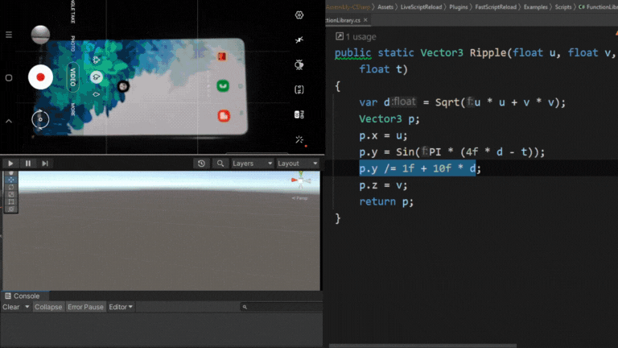

# How to build Hot Reload For Unity

I'm sure you don't have to imagine this scenario. You make a small script change to quickly see results. Unity welcomes you with dreaded 'reloading script assembles' screen. After 10 seconds you're ready to get back into playmode. Now just few more clicks to get where you already were. Now testing and...

... it didn't work, there's another small change needed.

All day long...

I'll share a way with you to hot-reload those changes without both full-domain-reload and playmode reset so you can see results in ~500ms and iterate on your code insanely fast.

# Blog post series
Code in this repo is accompanied by blog post series that digs deeper into technical bits.

[You can see it here](https://immersivevrtools.com/redirect/fast-script-reload/github--how-to-build-hot-reload-for-unity-repo/blog-post)

# Fast Script Reload - Ready Made Tool is available on the asset store

I've built Fast Script Reload to tackle those challanges, most of them are already solved and I'm constantly working on remaining ones.

You can grab a copy on the Unity Asset Store.

It's a huge help and allows me to improve the tool quicker for all of us :)